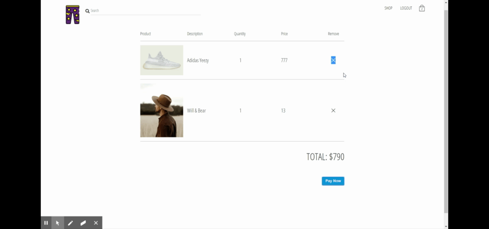

readme
# Matchless
e commerce website for shopping the latest clothing lines.
## Table of contents
* [General info](#general-info)
* [Screenshot](#screenshot)
* [Technologies](#technologies)
* [Setup](#setup)
* [API Documentation](#api-documentation)
* [Features](#features)
* [Code examples](#code-examples)
* [Status](#status)
* [Contact](#contact)
## General info
this project was done in one week by a team of four for RBK bootcamp Junior phase.
## Screenshot

## Technologies
Project is created with:
* mongoose version: 5.8.4
* express version:4.17.1
* React library version: 16.12.0
* NodeJS version: 12.13.0
## Setup
To run this project, install it locally using npm:

```
$ npm install
$ cd client
$ npm install
$ cd ..
$ npm run dev
```
Configure and export environment variables
you will have to make a config file with the name config.env inside a config directory in the root 
in order for the dotenv package to work.
add the following to the file:
```
# NODE_ENV= development or deployment
# PORT= portNumber

# MONGO_URI= database connection url
# JWT_SECRET= secretkey
# JWT_EXPIRE=jwt expire 
# STRIPE_SECRET_KEY= stripeSectetKey

```

## API Documentation 

* for api documentation you'll need to visit this link https://vast-sands-58549.herokuapp.com/ and hit the '/' endpoint 
## Features 
* view products by sections
* add items to cart
* checkout with stripe payment method
### To do 
* Admin dashboard 


## Code Examples
To search for items use special shortcode: `const search = (state = initialState, action) => {
  switch (action.type) {
    case SEARCH_QUERY:
      return {
        ...state,
        text: action.payload,
        loading: false
      };
    case FETCH_ITEM:
      return {
        ...state,
        results: action.payload
      };
    default:
      return state;
  }
};`

## Status
Project is finished

## Contact
created by @Salim-Alsaeh, @rue-elwahishi, @psktcsharp, and @Muftah-Elzawi

